# MCP Server with SQL Database Integration

This is a Model Context Protocol (MCP) server built with TypeScript and Express.js that provides comprehensive integration with SQL databases, Jira API, and intelligent AI-powered tools for data processing and analysis. The server uses Server-Sent Events (SSE) for real-time communication and features persistent storage for enhanced user experience.

## Key Features

### 🗄️ SQL Database Integration
- Complete CRUD operations for Users, Vendors, Commodities, Currencies, and Roles
- Advanced search and pagination capabilities
- Robust connection management with SQL Server
- Database health monitoring and connection testing

### 🎯 Jira Integration
- Comprehensive Jira API integration with JQL (Jira Query Language) support
- Intelligent JQL query generation using AI
- Persistent JQL example storage with similarity-based deduplication
- Issue creation, searching, and management
- Sprint and project analytics

### 🤖 AI-Powered Features
- OpenAI integration for intelligent tool routing and data processing
- Real-time streaming responses for better user experience
- Smart JQL query generation with learning capabilities
- Contextual data analysis and markdown formatting

### 📊 Data Management
- Products from DummyJSON API integration
- Users from DummyJSON API integration
- Real-time application status monitoring
- Persistent storage with automatic file synchronization

### 🔄 Real-time Communication
- Server-Sent Events (SSE) for streaming responses
- Multiple concurrent session management
- Graceful error handling and connection management

## Available Tools

### 🗄️ SQL Database Tools

#### User Management
- `get-users` - Get a list of users with optional pagination
- `get-user-by-id` - Get detailed information about a specific user by ID
- `search-users` - Search for users by keyword

#### Vendor Management
- `get-vendors` - Get a list of vendors with optional pagination
- `get-vendor-by-id` - Get detailed information about a specific vendor by ID
- `search-vendors` - Search for vendors by keyword

#### Commodity Management
- `get-commodities` - Get a list of commodities with optional pagination
- `get-commodity-by-id` - Get detailed information about a specific commodity by ID
- `search-commodities` - Search for commodities by keyword

#### Currency Management
- `get-currencies` - Get a list of currencies with optional pagination
- `get-currency-by-id` - Get detailed information about a specific currency by ID
- `search-currencies` - Search for currencies by keyword

#### Role Management
- `get-roles` - Get a list of roles with optional pagination
- `get-role-by-id` - Get detailed information about a specific role by ID
- `search-roles` - Search for roles by keyword

### 🎯 Jira Integration Tools
- `get-jira-issue-by-id` - Get detailed information about a specific Jira issue
- `search-jira-issues` - Search for Jira issues using intelligent JQL generation
- `create-jira-issue` - Create new Jira issues with specified project, summary, and issue type
- `create-jira-subtask` - Create subtasks under existing Jira issues

### 📊 Product & External API Tools
- `get-products` - Get a list of products with optional pagination from DummyJSON API
- `get-product-by-id` - Get detailed information about a specific product by ID
- `search-products` - Search for products by keyword
- `get-products-by-category` - Get all products in a specific category
- `get-categories` - Get a list of all product categories

### 🔍 Application Monitoring
- `get-application-status` - Get real-time status information for specific applications in different environments

## 🗄️ SQL Database Integration

This MCP server includes comprehensive SQL Server integration for enterprise-grade data management.

### Database Setup

1. **Install and Configure SQL Server**
   - Ensure SQL Server is installed and running
   - Create your target database

2. **Configure Database Connection**
   
   Create a `.env` file in the project root with your database credentials:
   ```env
   # SQL Server Configuration
   MSSQL_USER=your_username
   MSSQL_PASSWORD=your_password
   MSSQL_HOST=your_server_host
   MSSQL_DATABASE=your_database_name
   
   # Alternative: Connection String
   MSSQL_CONNECTION_STRING=Server=yourserver;Database=yourdatabase;User Id=username;Password=password;Encrypt=false;TrustServerCertificate=true;
   
   # OpenAI Configuration (Required for AI features)
   OPENAI_API_KEY=your_openai_api_key
   LLM_MODEL=gpt-4
   
   # Jira Configuration (Optional)
   JIRA_URL=https://your-domain.atlassian.net
   JIRA_USERNAME=your_email@example.com
   JIRA_API_TOKEN=your_jira_api_token
   ```

3. **Database Schema**
   
   The server expects the following tables in your SQL database:
   - `Users` - User management with roles and authentication details
   - `Vendors` - Vendor/supplier information
   - `Commodities` - Product commodities data
   - `Currencies` - Currency information
   - `Roles` - User role definitions

### Testing Database Connection

Verify your database setup:

```bash
npm run build
npm run test-connection
```

## 🎯 Jira Integration

### Setup Jira Integration

1. **Create Jira API Token**
   - Go to https://id.atlassian.com/manage-profile/security/api-tokens
   - Create a new API token
   - Add it to your `.env` file

2. **Configure Jira Settings**
   ```env
   JIRA_URL=https://your-domain.atlassian.net
   JIRA_USERNAME=your_email@example.com
   JIRA_API_TOKEN=your_jira_api_token
   ```

### Intelligent JQL Features

The server includes advanced JQL (Jira Query Language) capabilities:

- **AI-Powered JQL Generation**: Converts natural language queries to JQL
- **Persistent Learning**: Stores successful JQL examples for improved future queries
- **Smart Deduplication**: Prevents duplicate JQL examples using similarity detection
- **Real-time Synchronization**: JQL examples are immediately saved to `data/jql-examples.json`

### Example JQL Queries

The system learns from usage and can generate JQL for queries like:
- "Show me open bugs in the current sprint"
- "Get all tasks assigned to John Doe"
- "Find issues created this week with high priority"
- "Display all closed sprints for velocity analysis"

## 🤖 AI Integration

### OpenAI Configuration

The server uses OpenAI for intelligent data processing and query generation:

1. **Get OpenAI API Key**
   - Visit https://platform.openai.com/api-keys
   - Create a new secret key
   - Add it to your `.env` file

2. **Supported Models**
   - GPT-4 (recommended)
   - GPT-3.5-turbo
   - Any OpenAI-compatible model

### AI Features

- **Intelligent Tool Routing**: Automatically determines which tool to use based on user queries
- **Real-time Streaming**: Responses stream in real-time for better user experience
- **Context-Aware Processing**: Maintains context across multiple interactions
- **Data Formatting**: Automatically formats responses as markdown tables, charts, or text

## 🚀 Installation & Setup

### Prerequisites

- Node.js (v16 or higher)
- npm or yarn
- SQL Server (for database features)
- OpenAI API key (for AI features)
- Jira account (optional, for Jira integration)

### Installation Steps

1. **Clone the Repository**
   ```bash
   git clone <repository-url>
   cd MCP-SERVER
   ```

2. **Install Dependencies**
   ```bash
   npm install
   ```

3. **Environment Configuration**
   
   Copy the example environment file and configure your settings:
   ```bash
   copy .env.example .env
   ```
   
   Edit `.env` with your specific configuration (see setup sections above).

4. **Build the Project**
   ```bash
   npm run build
   ```

5. **Start the Server**
   ```bash
   npm run start
   ```

### Development Mode

For development with auto-recompilation and hot-reload:

```bash
npm run dev
```

## 🔧 VS Code Integration

### Available Tasks

The project includes VS Code tasks for easy development:

1. **Press `Ctrl+Shift+P`** and select "Tasks: Run Task"
2. Choose from available tasks:
   - **Build MCP Server**: Compiles TypeScript code
   - **Start MCP Server**: Builds and starts the server
   - **Dev MCP Server (Watch Mode)**: Development mode with auto-reload

### Debugging

Debug the MCP server in VS Code:

1. Press `F5` or select "Run > Start Debugging"
2. Choose the "Launch MCP Server" configuration
3. View debug output in the Debug Console

### Using with AI Assistants

1. Start the MCP server using the tasks above
2. Connect your AI assistant (like GitHub Copilot) to the server
3. Use natural language to request data and perform operations

## 📁 Project Structure

### 🏗️ Architecture Overview

```mermaid
graph TD
    A[🎯 MCP Server] --> B[🎮 Controllers Layer]
    A --> C[🏢 Services Layer]
    A --> D[📋 Models Layer]
    A --> E[⚙️ Configuration Layer]
    
    B --> B1[👥 User Controller]
    B --> B2[🎫 Jira Controller]
    B --> B3[📦 Product Controller]
    B --> B4[🏪 Vendor Controller]
    B --> B5[📊 Commodity Controller]
    B --> B6[💰 Currency Controller]
    B --> B7[🔐 Role Controller]
    
    C --> C1[🗄️ SQL Services]
    C --> C2[🎫 Jira Service]
    C --> C3[📦 Product Service]
    C --> C4[👥 User Service]
    
    C1 --> C1A[SQL User Service]
    C1 --> C1B[SQL Vendor Service]
    C1 --> C1C[SQL Commodity Service]
    C1 --> C1D[SQL Currency Service]
    C1 --> C1E[SQL Role Service]
    
    D --> D1[🗃️ Database Models]
    D --> D2[🌐 API Models]
    D --> D3[📝 Type Definitions]
    
    E --> E1[💾 Database Config]
    E --> E2[🌐 API Config]
    E --> E3[🗄️ MSSQL Config]
    
    F[🌍 External Systems] --> F1[🗄️ SQL Server Database]
    F --> F2[🎫 Jira API]
    F --> F3[📦 DummyJSON API]
    F --> F4[🤖 OpenAI API]
    
    G[💾 Data Storage] --> G1[📄 JQL Examples JSON]
    G --> G2[📊 Application Data]
    
    style A fill:#e1f5fe
    style B fill:#f3e5f5
    style C fill:#e8f5e8
    style D fill:#fff3e0
    style E fill:#fce4ec
    style F fill:#e0f2f1
    style G fill:#f1f8e9
```



### 🔄 Data Flow Architecture

```mermaid
sequenceDiagram
    participant 👤 Client
    participant 🌐 SSE Transport
    participant 🤖 AI Router
    participant 🎮 Controller
    participant 🏢 Service
    participant 🗄️ Database
    participant 🧠 OpenAI
    
    👤->>🌐: 📝 Natural Language Request
    🌐->>🤖: 🔀 Route Message
    🤖->>🧠: 🔍 Analyze Intent
    🧠-->>🤖: 🎯 Tool Selection
    🤖->>🎮: ⚡ Execute Tool
    🎮->>🏢: 🛠️ Business Logic
    🏢->>🗄️: 📊 Data Query
    🗄️-->>🏢: 📈 Raw Data
    🏢-->>🎮: 🔧 Processed Data
    🎮->>🧠: 📋 Format Request
    🧠-->>🎮: 📄 Formatted Response
    🎮-->>🌐: 🌊 Stream Response
    🌐-->>👤: ⚡ Real-time Output
```



### 📂 Detailed File Structure

```
MCP-SERVER/
├── 📁 data/                          # 💾 Persistent Data Storage
│   └── 📄 ...                        # 📄 Configuration files
│
├── 📁 src/                           # 💻 Source Code
│   ├── 📄 ...                        # 📄 TypeScript files
│   │
│   ├── 📁 app-data/                  # 📊 Application Data
│   │   └── 📄 ...                    # 📄 TypeScript files
│   │
│   ├── 📁 config/                    # ⚙️ Configuration Files
│   │   ├── 📄 ...                    # 📄 TypeScript files
│   │   ├── 📄 ...                    # 📄 TypeScript files
│   │   ├── 📄 ...                    # 📄 TypeScript files
│   │   └── 📄 ...                    # 📄 TypeScript files
│   │
│   ├── 📁 controllers/               # 🎮 MCP Tool Controllers
│   │   ├── 📄 ...                    # 📄 TypeScript files
│   │   ├── 📄 ...                    # 📄 TypeScript files
│   │   ├── 📄 ...                    # 📄 TypeScript files
│   │   ├── 📄 ...                    # 📄 TypeScript files
│   │   ├── 📄 ...                    # 📄 TypeScript files
│   │   ├── 📄 ...                    # 📄 TypeScript files
│   │   └── 📄 ...                    # 📄 TypeScript files
│   │
│   ├── 📁 db-models/                 # 🗃️ Database Models
│   │   ├── 📄 ...                    # 📄 TypeScript files
│   │   ├── 📄 ...                    # 📄 TypeScript files
│   │   ├── 📄 ...                    # 📄 TypeScript files
│   │   ├── 📄 ...                    # 📄 TypeScript files
│   │   └── 📄 ...                    # 📄 TypeScript files
│   │
│   ├── 📁 llm-api/                   # 🤖 AI Integration
│   │   ├── 📄 ...                    # 📄 TypeScript files
│   │   └── 📄 ...                    # 📄 TypeScript files
│   │
│   ├── 📁 models/                    # 📋 Data Models
│   │   ├── 📄 ...                    # 📄 TypeScript files
│   │   ├── 📄 ...                    # 📄 TypeScript files
│   │   └── 📄 ...                    # 📄 TypeScript files
│   │
│   ├── 📁 modules/                   # 🔧 Core Server Modules
│   │   └── 📄 ...                    # 📄 TypeScript files
│   │
│   ├── 📁 services/                  # 🏢 Business Logic Services
│   │   ├── 📄 ...                    # 📄 TypeScript files
│   │   ├── 📄 ...                    # 📄 TypeScript files
│   │   ├── 📄 ...                    # 📄 TypeScript files
│   │   ├── 📄 ...                    # 📄 TypeScript files
│   │   ├── 📄 ...                    # 📄 TypeScript files
│   │   ├── 📄 ...                    # 📄 TypeScript files
│   │   ├── 📄 ...                    # 📄 TypeScript files
│   │   └── 📄 ...                    # 📄 TypeScript files
│   │
│   ├── 📁 types/                     # 📝 TypeScript Definitions
│   │   ├── 📄 ...                    # 📄 TypeScript files
│   │   └── 📄 ...                    # 📄 TypeScript files
│   │
│   └── 📁 utils/                     # 🛠️ Utility Functions
│       └── 📄 ...                    # 📄 TypeScript files
│
├── 📁 scripts/                       # 🔨 Build & Deployment
│   └── 📄 ...                        # 📄 JavaScript files
│
├── 📄 ...                            # 📄 HTML files
├── 📄 ...                            # 📄 Configuration files
├── 📄 ...                            # 📄 Configuration files
├── 📄 ...                            # 📄 Configuration files
└── 📄 ...                            # 📄 Documentation files
```

### 🔀 Component Interaction Map

```mermaid
graph LR
    subgraph "🌍 External APIs"
        EXT1[🗄️ SQL Server]
        EXT2[🎫 Jira API]
        EXT3[📦 DummyJSON]
        EXT4[🤖 OpenAI]
    end
    
    subgraph "🎯 MCP Server Core"
        SSE[🌐 SSE Transport]
        ROUTE[🤖 AI Router]
        CTRL[🎮 Controllers]
        SVC[🏢 Services]
    end
    
    subgraph "💾 Data Layer"
        DB[(🗄️ Database)]
        FILES[📄 JSON Files]
    end
    
    CLIENT[👤 Client] --> SSE
    SSE --> ROUTE
    ROUTE --> CTRL
    CTRL --> SVC
    
    SVC --> EXT1
    SVC --> EXT2
    SVC --> EXT3
    SVC --> EXT4
    
    SVC --> DB
    SVC --> FILES
    
    style CLIENT fill:#e3f2fd
    style SSE fill:#f1f8e9
    style ROUTE fill:#fff3e0
    style CTRL fill:#fce4ec
    style SVC fill:#e8f5e8
    style DB fill:#e0f2f1
    style FILES fill:#f3e5f5
```



## 🔍 API Reference & Data Sources

### External APIs
- **DummyJSON Products**: https://dummyjson.com/products
- **DummyJSON Users**: https://dummyjson.com/users
- **Jira REST API**: Atlassian Cloud/Server REST API v2/v3
- **OpenAI API**: GPT models for intelligent processing

### Response Formats

The server supports multiple response formats:
- **Markdown Tables**: Structured data in table format
- **Markdown Text**: Formatted text with analysis
- **Charts**: Data visualization using chart libraries
- **JSON**: Raw structured data

## 🚦 Server Communication

### Server-Sent Events (SSE)

The server uses SSE for real-time communication:

- **Endpoint**: `/sse/stream`
- **Message Endpoint**: `/messages`
- **Session Management**: Automatic session handling with IDs
- **Streaming Responses**: Real-time data streaming for better UX

### CORS Configuration

The server is configured to handle cross-origin requests with appropriate CORS headers.

## 💡 Usage Examples

### Basic Queries

```bash
# Get all users with pagination
curl "http://localhost:3000/messages" -X POST \
  -H "Content-Type: application/json" \
  -d '{"message": "show me all users"}'

# Search for specific vendor
curl "http://localhost:3000/messages" -X POST \
  -H "Content-Type: application/json" \
  -d '{"message": "find vendor with name containing Microsoft"}'

# Get Jira issues
curl "http://localhost:3000/messages" -X POST \
  -H "Content-Type: application/json" \
  -d '{"message": "show me open bugs in current sprint"}'
```

### Natural Language Queries

The AI-powered server understands natural language:

- "Show me all high-priority bugs assigned to John"
- "Get the last 10 vendors created this month"
- "Find all USD currency transactions"
- "Display sprint velocity chart for closed sprints"
- "List all users with admin role"

### JQL Learning Examples

The server learns from JQL usage:

```
User Query: "show me open bugs"
Generated JQL: project = SCRUM AND issuetype = Bug AND status != "Done" ORDER BY priority DESC
Saved: ✅ (New example learned)

User Query: "get open bugs"  
Generated JQL: project = SCRUM AND issuetype = Bug AND status != "Done" ORDER BY priority DESC
Saved: ❌ (Duplicate detected - 85% similarity)
```

## 🛠️ Customization

### Adding New Tools

1. **Create Controller**
   ```typescript
   // src/controllers/myController.ts
   export function registerMyTools(server: McpServer) {
     server.tool('my-tool', 'Description', schema, handler);
   }
   ```

2. **Register in Main**
   ```typescript
   // src/index.ts
   import { registerMyTools } from './controllers/myController.js';
   registerMyTools(server);
   ```

### Extending Database Models

1. **Add Interface**
   ```typescript
   // src/db-models/myModel.ts
   export interface MyModel {
     Id: number;
     Name: string;
     // ... other fields
   }
   ```

2. **Create Service**
   ```typescript
   // src/services/myService.ts
   export class MyService {
     async getAll(): Promise<MyModel[]> {
       // Implementation
     }
   }
   ```

### Customizing AI Prompts

Edit prompts in `src/llm-api/prompts.ts`:

```typescript
export const MyCustomPrompt = `
Your custom system prompt here...
Format responses as markdown tables.
`;
```

## 🐛 Troubleshooting

### Common Issues

1. **Database Connection Failed**
   - Verify SQL Server is running
   - Check credentials in `.env` file
   - Test with `npm run test-connection`

2. **OpenAI API Errors**
   - Verify API key is valid
   - Check model availability
   - Monitor API usage limits

3. **Jira Authentication Failed**
   - Ensure API token is correct
   - Verify Jira URL format
   - Check user permissions

4. **Port Already in Use**
   - Change port in configuration
   - Kill existing processes: `npx kill-port 3000`

### Debug Mode

Enable detailed logging:
```bash
DEBUG=mcp:* npm run start
```

### Log Files

Check logs in:
- Console output for real-time logs
- `data/jql-examples.json` for JQL learning progress
- SQL Server logs for database issues

## 📈 Performance Monitoring

### Metrics Available

- Database connection health
- API response times
- JQL query success rates
- Memory usage patterns
- Active session counts

### Health Checks

```bash
# Database health
curl "http://localhost:3000/messages" -X POST \
  -H "Content-Type: application/json" \
  -d '{"message": "check database health"}'

# Application status
curl "http://localhost:3000/messages" -X POST \
  -H "Content-Type: application/json" \
  -d '{"message": "get application status for MyApp in production"}'
```

## 🤝 Contributing

1. Fork the repository
2. Create a feature branch
3. Make your changes
4. Add tests if applicable
5. Submit a pull request

### Development Guidelines

- Follow TypeScript best practices
- Add proper error handling
- Include JSDoc comments
- Test database operations
- Validate all inputs with Zod schemas

## 📄 License

This project is licensed under the ISC License - see the package.json file for details.

## 🆘 Support

For support and questions:
- Check the troubleshooting section above
- Review the project issues on GitHub
- Consult the MCP Protocol documentation
- Check OpenAI API documentation for AI-related issues

---

**Built with ❤️ using the Model Context Protocol (MCP)**
